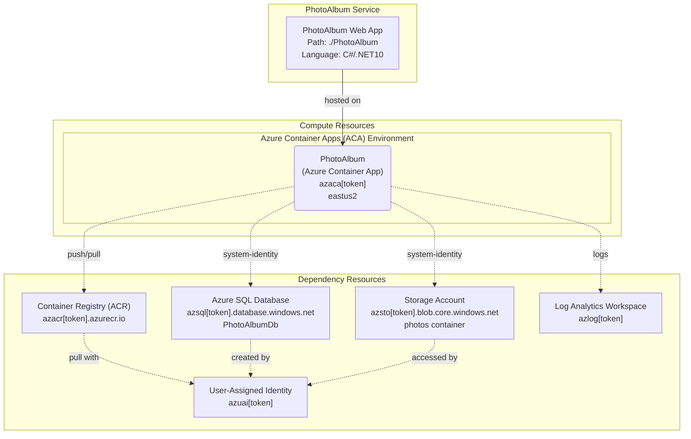

# Azure Deployment Plan for PhotoAlbum Project

## **Goal**
Deploy the PhotoAlbum application to Azure Container Apps using AzCLI with Bicep infrastructure-as-code. The deployment will provision all required Azure resources and deploy the containerized application.

## **Project Information**

**PhotoAlbum**
- **Stack**: ASP.NET Core 10.0 (Razor Pages)
- **Type**: Photo management web application with image upload/processing
- **Containerization**: Dockerfile present (./Dockerfile, uses .NET 9.0 SDK and ASP.NET Runtime)
- **Language**: C#
- **Dependencies**: 
  - EF Core 10.0.12 (SQL Server provider)
  - SixLabors.ImageSharp 3.1.11 (image processing)
  - Azure.Storage.Blobs 12.23.0 (blob storage)
  - Azure.Identity 1.17.1 (managed identity)
- **Hosting**: Azure Container Apps (Consumption plan)
- **Database**: Azure SQL Database (Basic tier, 2GB)
- **Storage**: Azure Blob Storage (Standard LRS)
- **Authentication**: Managed Identity for Azure services

## **Azure Resources Architecture**



## **Existing Azure Resources**

| Resource Type | Name | SKU | Location | Status | Purpose |
|---|---|---|---|---|---|
| Resource Group | rg-photoalbum-dev | N/A | eastus2 | ✓ Exists | Target RG for all resources |
| Subscription | cdea6d05-fcb9-446b-b0d4-2f71071885c4 | N/A | N/A | ✓ Exists | Target subscription |

**Missing Resources (to be provisioned):**
- Container Registry (azacr[token])
- Container Apps Environment (azaca-env[token])
- Container App (azaca[token])
- User-Assigned Managed Identity (azuai[token])
- Log Analytics Workspace (azlog[token])
- SQL Server (azsql[token])
- SQL Database (PhotoAlbumDb)
- Storage Account (azsto[token])
- Blob Container (photos)

## **Execution Steps**

> **CRITICAL: Do NOT run 'az login' until 'Env setup' step.**

### **Step 1: Containerization**
- [x] Dockerfile exists: `./Dockerfile` (multi-stage build with .NET 9.0)
- [ ] Build Docker image locally (validation)
- [ ] Create ACR build script

**Checklist:**
- [ ] Dockerfile validated
- [ ] Docker build context verified (root directory)
- [ ] Image build script created

### **Step 2: Env setup for AzCLI**
- [ ] Verify AZ CLI is installed: `az version`
- [ ] Login to Azure: `az login`
- [ ] Set default subscription: `az account set --subscription cdea6d05-fcb9-446b-b0d4-2f71071885c4`
- [ ] Install Service Connector extension: `az extension add --name serviceconnector-passwordless --upgrade`
- [ ] Verify subscription context

**Checklist:**
- [ ] AZ CLI installed and working
- [ ] Authenticated to correct subscription
- [ ] Extensions installed
- [ ] Default subscription verified

### **Step 3: Infrastructure Provisioning**
- [ ] Verify resource group exists: `rg-photoalbum-dev`
- [ ] Use Bicep to provision missing Azure resources via `infrastructure-bicep-generation` skill
- [ ] Generate deployment parameters
- [ ] Run Bicep deployment: `az deployment group create`

**Deployment Parameters:**
- Environment Name: `dev`
- Location: `eastus2`
- SQL Admin Username: `sqladmin`
- SQL Admin Password: `[to be set securely]`
- Service Web Image: `azacr[token].azurecr.io/photoalbum:latest`

**Checklist:**
- [ ] Resource group verified
- [ ] Bicep templates prepared
- [ ] Parameter values validated
- [ ] Deployment executed successfully
- [ ] All resources in 'Succeeded' state

### **Step 4: Verify Azure Resources Existence**

#### 4.1 Container App Deployment Target
```bash
az containerapp show -n azaca[token] -g rg-photoalbum-dev -o json
```
Required state: `provisioningState: Succeeded`, `runningStatus: Running`

**Checklist:**
- [ ] Container App exists
- [ ] FQDN: azaca[token].eastus2.azurecontainerapps.io
- [ ] Status verified as Running

#### 4.2 Container Registry Access
```bash
az acr show -n azacr[token] -g rg-photoalbum-dev -o json
```
Required: Login server available

**Checklist:**
- [ ] ACR exists and accessible
- [ ] Login server: azacr[token].azurecr.io
- [ ] Admin access disabled (secure by default)

#### 4.3 SQL Database Connectivity
```bash
az sql server show -n azsql[token] -g rg-photoalbum-dev -o json
az sql db show -n PhotoAlbumDb -s azsql[token] -g rg-photoalbum-dev -o json
```
Required: Database online, firewall rules allowing Container Apps

**Checklist:**
- [ ] SQL Server provisioned
- [ ] PhotoAlbumDb database created
- [ ] Managed Identity has access
- [ ] Firewall rules configured

#### 4.4 Storage Account Setup
```bash
az storage account show -n azsto[token] -g rg-photoalbum-dev -o json
az storage container exists -n photos --account-name azsto[token]
```
Required: Storage accessible, photos container created

**Checklist:**
- [ ] Storage Account provisioned
- [ ] Photos container exists
- [ ] Managed Identity has Blob Contributor role
- [ ] CORS enabled for web access

### **Step 5: Build and Deploy Application**

#### 5.1 Build and Push Docker Image to ACR
Create deploy script (`./deploy-scripts/build-and-deploy.ps1`):
- Build image: `docker build -t photoalbum:latest .`
- Tag image: `docker tag photoalbum:latest azacr[token].azurecr.io/photoalbum:latest`
- Push to ACR: `az acr build --registry azacr[token] --image photoalbum:latest .`

**Checklist:**
- [ ] Login script created
- [ ] Build script created
- [ ] Image built successfully
- [ ] Image pushed to ACR
- [ ] ACR image verified

#### 5.2 Deploy to Container App
Create deployment script with:
- Update Container App image reference
- Configure environment variables:
  - `ConnectionStrings__PhotoAlbumDb`: Connection string from Bicep output
  - `BlobStorageConnectionString`: Storage connection string
- Deploy: `az containerapp update --name azaca[token] --resource-group rg-photoalbum-dev --image azacr[token].azurecr.io/photoalbum:latest`

**Checklist:**
- [ ] Environment variables configured
- [ ] Image deployment executed
- [ ] Container App revision updated
- [ ] Deployment status: Active

### **Step 6: Deployment Validation**

#### 6.1 Check Application Logs
```bash
az containerapp logs show -n azaca[token] -g rg-photoalbum-dev
```
Call `appmod-get-app-logs` tool to verify:
- Application started successfully
- No startup errors
- Database connectivity verified
- No critical errors in logs

**Checklist:**
- [ ] Logs retrieved and analyzed
- [ ] Application is running
- [ ] No database connectivity errors
- [ ] Health checks passing

#### 6.2 Verify HTTPS Endpoint
- [ ] FQDN is accessible: `https://azaca[token].eastus2.azurecontainerapps.io`
- [ ] Returns HTTP 200 or redirects to login
- [ ] SSL/TLS certificate valid

**Checklist:**
- [ ] Endpoint accessible
- [ ] SSL/TLS working
- [ ] Application responsive

### **Step 7: Summarize Result**
- [ ] Call `appmod-summarize-result` tool
- [ ] Generate deployment-summary.md with:
  - Successful resource provisioning details
  - Container image information
  - Deployment endpoints and access info
  - Post-deployment validation results

**Checklist:**
- [ ] Summary generated
- [ ] All resources documented
- [ ] Access information provided
- [ ] Next steps documented

## **Progress Tracking**

Current Progress: Starting Deployment
```
⏳ Step 1: Containerization - Pending
⏳ Step 2: Env setup - Pending
⏳ Step 3: Infrastructure Provisioning - Pending
⏳ Step 4: Verify Azure Resources - Pending
⏳ Step 5: Build and Deploy - Pending
⏳ Step 6: Validation - Pending
⏳ Step 7: Summarize - Pending
```

Updates will be tracked in `progress.md`

## **Tools Checklist**

**Required Tools (must be called):**
- [ ] `infrastructure-bicep-generation` - Generate/validate Bicep files
- [ ] `appmod-get-app-logs` - Retrieve and analyze application logs
- [ ] `appmod-summarize-result` - Create deployment summary

**Optional Tools:**
- [ ] `appmod-analyze-repository` - Analyze project structure (already done)
- [ ] `appmod-plan-generate-dockerfile` - Generate Dockerfile (already exists)
- [ ] `appmod-build-docker-image` - Build image locally if ACR unavailable

## **Deployment Configuration**

**Key Parameters:**
- **Subscription ID**: `cdea6d05-fcb9-446b-b0d4-2f71071885c4`
- **Resource Group**: `rg-photoalbum-dev`
- **Location**: `eastus2`
- **Environment Name**: `dev`
- **Container App Name Pattern**: `azaca[token]`
- **SQL Server Name Pattern**: `azsql[token]`
- **Storage Account Name Pattern**: `azsto[token]`
- **Container Registry Name Pattern**: `azacr[token]`
- **Log Analytics Pattern**: `azlog[token]`
- **Identity Name Pattern**: `azuai[token]`

**Timeout/Retry Configuration:**
- Resource provisioning timeout: 30 minutes
- Deployment timeout: 10 minutes
- Log retrieval timeout: 5 minutes
- Retry attempts: 3 with exponential backoff

---

**Status**: Ready for execution
**Last Updated**: [Timestamp of plan creation]
**Created By**: AzCLI Container App Deployment Skill
